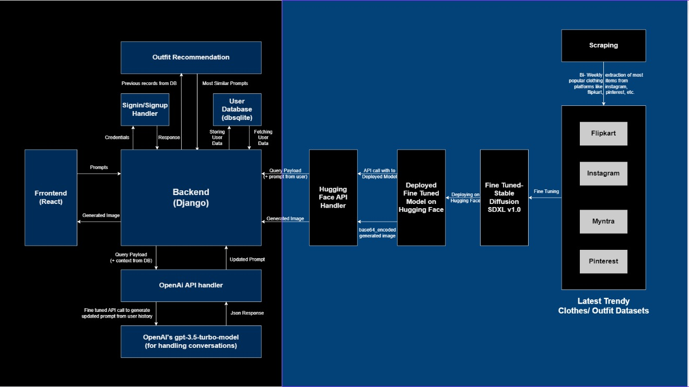
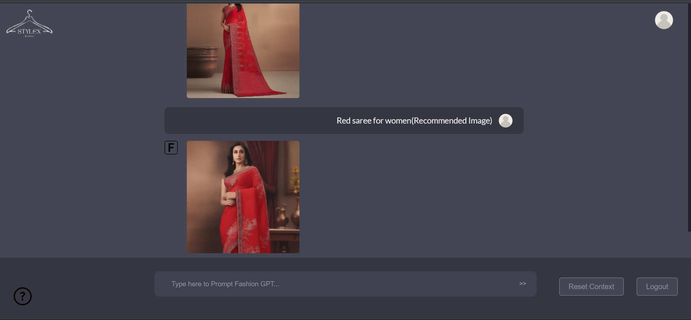
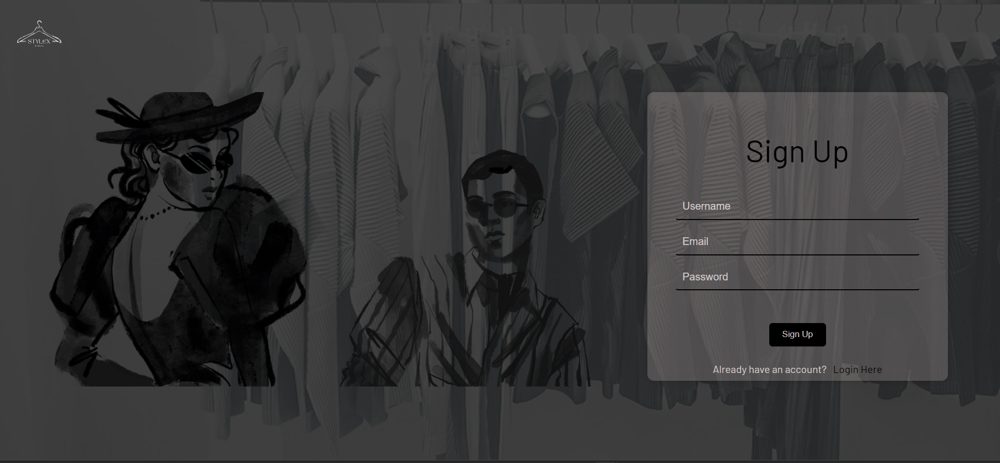
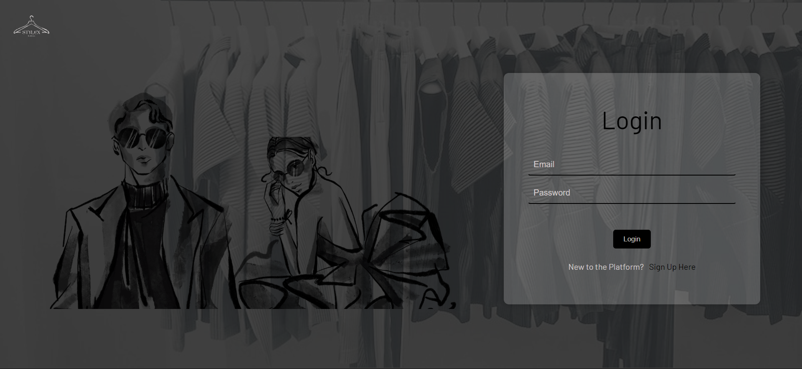
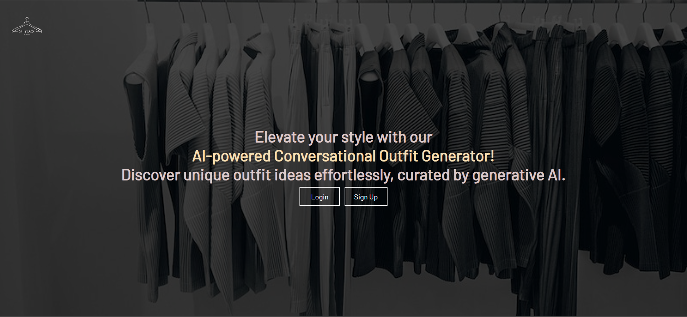

## Conversational Fashion generator powered by genAI

### Objectives 
 - Gen AI-Powered Fashion Outfit Generator: Develop a functional and intuitive conversational AI system.
 - User Data Integration: Integrate mechanisms to collect and analyze user data, including past purchase history, browsing preferences.
 - Personalized Outfit Recommendations: The generator should be capable of understanding a user's unique fashion preferences. 
 - Social Media Trend Analysis: Implement features that allow the AI to analyze and incorporate real-time fashion trends.. 
 - Interactive Feedback Loop: Enable users to provide feedback and interact with the AI to refine outfit recommendations. 
 - Versatile Outfit Suggestions: The AI should be capable of generating outfit recommendations for various occasions, styles, age-specific, regional specific and user profiles.


### UseCase

 - P0-An Gen AI-powered fashion outfit generator for Flipkart that revolutionizes the way users discover and create personalized fashion outfits, in a natural conversational way.

 - P1-The generator should consider factors such as the user's body type, occasion (e.g., casual, formal, party), and regional and age preferences.

 - P2-Users should also be able to interact with the outfit generator to give it feedback in terms of what they like, dont like and be able to tweak the outfits in the manner of a conversation.

 - P3- The generator can take into account the types of clothing items the user frequently views or adds to their cart, ensuring that the outfit recommendations are relevant and appealing.

 - P4- Generator has considered user's preferences, browsing habits, and the latest fashion trends.


## Info

 `The application is tested on python version 3.10 
  and node version v16.17.0 and npm version 8.15.0`
## Tech Stack

**Client:** React, Scss-Sass, React-Toastify

**Server:** Python - Django/Django REST

**Models:** Stable Diffusion XLv1.0, LoRA, ChatGPT-3.5(api)

**Cloud:** Ms Azure - Blob Storage


## Installation

Clone the repository 

  Steps to Run Backend

  - add an .env to the root directory of the repository
 ```bash
  JWT_SECRET=""
  JWT_ALGORITHM=""
  AZURE_ACCOUNT_URI=""
  AZURE_ACCOUNT_NAME=""
  HUGGING_FACE_TOKEN=""
  OPENAI_API_KEY=""
```
 - activate a new environment named test
 ```bash
  py -m venv test
  test\scripts\activate
  pip install -r requirements.txt
  ```
  - Migrate and runserver
  ```bash
  python manage.py migrate
  python manage.py runserver
  (create a superuser by 
  python manage.py createsuperuser
  to access admin panel)
  ``` 
  Steps to run Frontend 

  ```bash
   cd z_client
   npm install --legacy-peer-deps
   npm start
  ```


    
### Methodology
Data Scrapping

Scraped data from the following websites:

 - Flipkart - from the user's purchase history and wishlist
 - Pinterest - images with prompt, of trendy latest outfits
 - Instagram - Images with hashtags, related to trendy, latest outfits.
 - Myntra - Latest clothing products metadata along with images

Stored all this data into a dataset, and then sent time custom dataset for fine tuning.

Generative Model

 - Stable Diffusion involves three parts: VAE, U-Net, and optional text encoder. VAE compresses images, U-Net denoises them. .
 - Fine Tuned this model on Custom Dataset.
 - Deployed model on Hugging Face hub.
 - Access model through Inference API.
 - Takes input as prompt, returns base64 encoded image link.

Conversation (Chat and Feedback feature)

 - Used one of the best text model gpt-3.5-turbo with fine tuning to extract info from the user's entered prompt, and taking search history as context, and generate a new prompt.

 - It will take new prompt from user, fetch history from DB, sends requests through openAI API key, and return the new generated prompt

Recommendation (Personalized Results)

 - Fetch old prompts from the database.
 - Find the most similar prompt from the entered prompt using the similarity matrix.
 - If the search history > 2, then find the most similar prompt from the history else there are some default prompts based on keywords from the user prompt.

 
## Future Scope

 - Linking with Flipkart: This application will be linked with Flipkart so that it can consider user order history/ Wishlist from Flipkart and can provide more personalized results.
 - Virtual Try-On: Can be integrated with Flipkart to provide virtual try-on experiences. Customers could describe the type of clothing they are looking for, and the generator could provide personalized images of models wearing those outfits, helping customers make informed purchasing decisions.
 - Higher Resolution and Detail: Improving the generator's ability to produce high-resolution and detailed images.
 - Continual Learning: Allowing the model to continuously learn from new fashion trends
 - Hybrid Models: Combining text-to-image generation with other AI technologies, such as style recommendation systems or trend prediction models, can create more comprehensive and powerful fashion solutions.
## Authors

- Jai Anand [@j-a-i-a-n-a-n-d](https://www.linkedin.com/in/jaiiianand/)
- Nilesh Popli [@Adrenex](https://www.linkedin.com/in/nileshpopli/)
- Harshit Bajeta [@harshitbajeta](https://www.linkedin.com/in/harshit-bajeta-8a4644212/)


## Screenshots










